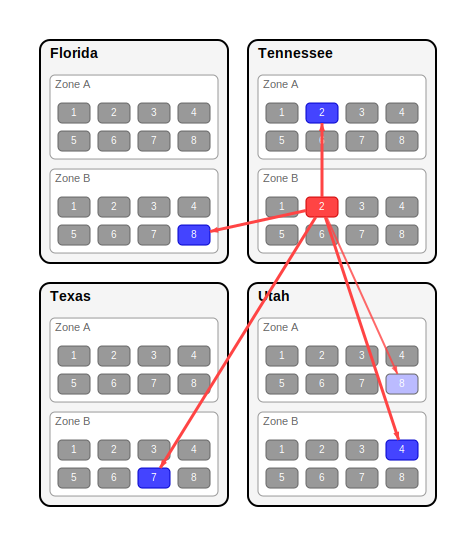

# Rendevous Hash Visual

An interactive web application for visualizing [Rendevous Hashing](https://en.wikipedia.org/wiki/Rendezvous_hashing) (also known as Highest Random Weight hashing) with topology awareness. Built with Phoenix LiveView and Elixir.

## Overview

This application provides a real-time, interactive visualization of how Rendevous hashing distributes data across a multi-region, multi-zone cloud infrastructure. It demonstrates how consistent hashing works while respecting geographical and topological constraints for optimal fault tolerance.

## Features

- **Interactive Configuration**: Dynamically adjust regions, availability zones, VM counts, and replication factors
- **Real-time Visualization**: SVG-based visualization updates instantly as you modify parameters
- **Topology Awareness**: Option to respect geographical distribution for enhanced fault tolerance
- **Animation Support**: Watch the selection process unfold with animated transitions
- **Responsive Design**: Built with Tailwind CSS for a modern, mobile-friendly interface

## Key Concepts

- **Rendevous Hashing**: A consistent hashing algorithm that provides even distribution without requiring knowledge of all nodes
- **Topology Constraints**: Geographic distribution awareness to ensure replicas are placed across different failure domains
- **Multi-Region Architecture**: Simulates real-world cloud deployments across regions and availability zones

## Getting Started

### Prerequisites

- Elixir 1.15+
- Erlang/OTP 26+
- Node.js (for asset compilation)

### Installation

1. Clone the repository:
   ```bash
   git clone https://github.com/chgeuer/rendevous_hash_visual.git
   cd rendevous_hash_visual
   ```

2. Install dependencies and setup the project:
   ```bash
   mix setup
   ```

3. Start the Phoenix server:
   ```bash
   mix phx.server
   ```

4. Visit [`localhost:4000`](http://localhost:4000) in your browser

## Usage

### Configuration Panel

- **Actor ID**: The data identifier being hashed (e.g., "Patient Zero")
- **Regions**: Comma-separated list of geographic regions (e.g., "Texas, Tennessee, Utah, Florida")
- **Zones**: Comma-separated list of availability zones (e.g., "Zone A, Zone B")
- **Virtual Machines**: Number of VMs per availability zone (1-32)
- **Replication Factor**: Number of replica nodes to select (1 to total nodes)
- **Topology Constraints**: When enabled, optimizes selection for geographic fault tolerance
- **Animation**: Enables animated visualization of the selection process

### Visualization

The right panel shows an SVG visualization depicting:

- Node distribution across regions and zones
- Selected replica nodes highlighted
- Animated progression through the selection algorithm (when enabled)



## Architecture

### Core Components

- **`InteractiveSvgLive`**: Phoenix LiveView component handling user interactions
- **`InteractiveState`**: Reactive state management with automatic field dependencies
- **`SvgAnimator`**: Animation engine for multi-frame SVG sequences
- **`RendevousHashTopology`**: Core hashing and topology logic (external dependency)

### Dependencies

- **Phoenix LiveView**: Real-time web interface
- **ReactiveStruct**: Reactive state management with computed fields
- **RendevousHashTopology**: Core rendevous hashing implementation
- **TailwindCSS**: Styling and responsive design
- **Heroicons**: UI iconography

## Development

### Running Tests

```bash
mix test
```

### Code Quality

The project includes several code quality tools:

```bash
# Run all quality checks
mix precommit

# Individual tools
mix format        # Code formatting
mix credo        # Static analysis
mix compile --warnings-as-errors
```

### Asset Development

```bash
# Watch for asset changes during development
mix phx.server

# Build assets for production
mix assets.deploy
```

## Deployment

For production deployment, see the [Phoenix deployment guides](https://hexdocs.pm/phoenix/deployment.html).

### Production Build

```bash
# Set production environment
export MIX_ENV=prod

# Install dependencies and compile
mix deps.get --only prod
mix compile

# Build assets
mix assets.deploy

# Generate release
mix release
```

## Contributing

1. Fork the repository
2. Create a feature branch (`git checkout -b feature/amazing-feature`)
3. Make your changes
4. Run the test suite and quality checks (`mix precommit`)
5. Commit your changes (`git commit -m 'Add amazing feature'`)
6. Push to the branch (`git push origin feature/amazing-feature`)
7. Open a Pull Request

## Learn More

- [Wikipedia: Rendezvous Hashing](https://en.wikipedia.org/wiki/Rendezvous_hashing)
- [Original Paper: A Name-Based Mapping Scheme for Rendezvous](https://www.eecs.umich.edu/techreports/cse/96/CSE-TR-316-96.pdf)
- [Rendezvous Hashing: The Path to Faster Hashes Calculation](https://www.npiontko.pro/2024/12/23/computation-efficient-rendezvous-hashing) - An optimization I'm using to speed up the hash process.